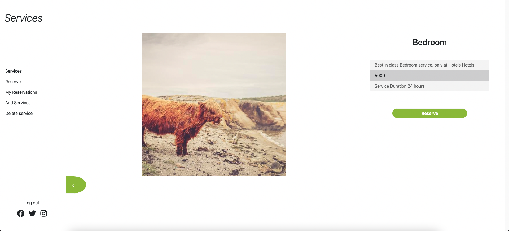

# Hotel Booking app Frontend

> React Frontend of the project





Additional description about the project and its features.

## Built With

- Javascript
- React
- Redux

## Live Demo

Coming soon


### Installation
1. Clone the repo
   ```sh
   git clone git@github.com:AdedayoOpeyemi/hotel_services_frontend.git
   ```
2. Install NPM packages
   ```sh
   npm install
   ```
   2. Start the server 
   ```sh
   npm start
   ```
3. Back-end API access on:
    ```
    https://github.com/RokoVarano/hotel_services_backend
    ```
### Prerequisites

* No prerequisites needed for this project.

### Usage

* Login or Sign up only with username.
* In the Carousel select the service you want.
* The selection will give more details about the project.
* To add a service fill and submit the form.
* To delete a service, click on the delete button. 


### Deployment


## Authors

👤 **Andres Castañeda**

- GitHub: [@githubhandle](https://github.com/afcastaneda223)
- Twitter: [@twitterhandle](https://twitter.com/twitterhandle)
- LinkedIn: [LinkedIn](https://linkedin.com/in/linkedinhandle)

👤 **Rodrigo Ibaceta Jimenez**

- GitHub: [@githubhandle](https://github.com/RokoVarano)
- Twitter: [@twitterhandle](https://twitter.com/twitterhandle)
- LinkedIn: [LinkedIn](https://linkedin.com/in/linkedinhandle)

👤 **Lucas FS**

- GitHub: [@githubhandle](https://github.com/notlfish)
- Twitter: [@twitterhandle](https://twitter.com/twitterhandle)
- LinkedIn: [LinkedIn](https://linkedin.com/in/linkedinhandle)

👤 **Opeyemi Oyelesi**

- GitHub: [@githubhandle](https://github.com/AdedayoOpeyemi)
- Twitter: [@twitterhandle](https://twitter.com/twitterhandle)
- LinkedIn: [LinkedIn](https://linkedin.com/in/linkedinhandle)
## 🤝 Contributing

Contributions, issues, and feature requests are welcome!

Feel free to check the [issues page](../../issues/).

## Show your support

Give a ⭐️ if you like this project!

## Acknowledgments

- Special thanks to [Murat Korkmaz](https://www.behance.net/muratk) for allowing us to use his [Vespa Design](https://www.behance.net/gallery/26425031/Vespa-Responsive-Redesign)

## 📝 License

This project is [MIT](./MIT.md) licensed.