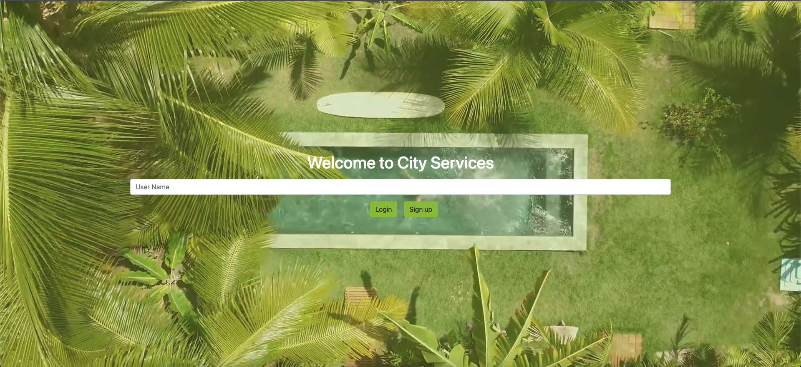
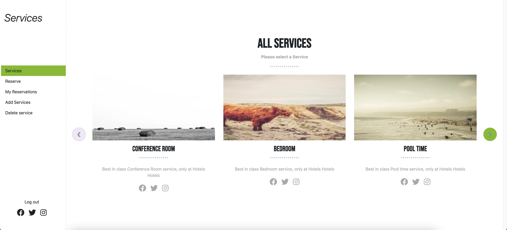

# Hotel Booking app Front-end

### Back-end API access on:
    https://github.com/RokoVarano/hotel_services_backend

> React Frontend of the project





Additional description about the project and its features.

## Built With
- Javascript
- React
- Redux
- Bootstrap

## Installation

**Follow the Back-end instructions available on:**

```
https://github.com/RokoVarano/hotel_services_backend
```

1. Clone the repo
   ```sh
   git clone git@github.com:AdedayoOpeyemi/hotel_services_frontend.git
   ```
2. Install NPM packages
   ```sh
   npm install
   ```
   2. Start the server
   ```sh
   npm start
   ```

### Testing

1. Run 
   ```sh
   yarn test
   ```

### Prerequisites

* No prerequisites needed for this project.

### Usage

* Login or Sign up only with username.
* On the services page select the service that you want.
* The selection will give more details on the service page about the selected one.
* To add a service fill and submit the form.
* To delete a service, click on the delete button.
* On My Reservations page you will be able to see a list of all your reservations, and also be able to cancel any of them.
* On the Reserve page you will be able to generate a new reservations for any service by filling up the date and the city of your choice.

## Authors

👤 **Andres Castañeda**

- GitHub: [@githubhandle](https://github.com/afcastaneda223)
- Twitter: [@twitterhandle](https://twitter.com/twitterhandle)
- LinkedIn: [LinkedIn](https://linkedin.com/in/linkedinhandle)

👤 **Rodrigo Ibaceta Jimenez**

- GitHub: [@githubhandle](https://github.com/RokoVarano)
- Twitter: [@twitterhandle](https://twitter.com/twitterhandle)
- LinkedIn: [LinkedIn](https://linkedin.com/in/linkedinhandle)

👤 **Lucas FS**

- GitHub: [@githubhandle](https://github.com/notlfish)
- Twitter: [@twitterhandle](https://twitter.com/twitterhandle)
- LinkedIn: [LinkedIn](https://linkedin.com/in/linkedinhandle)

👤 **Opeyemi Oyelesi**

- GitHub: [@githubhandle](https://github.com/AdedayoOpeyemi)
- Twitter: [@twitterhandle](https://twitter.com/twitterhandle)
- LinkedIn: [LinkedIn](https://linkedin.com/in/linkedinhandle)
## 🤝 Contributing

Contributions, issues, and feature requests are welcome!

Feel free to check the [issues page](../../issues/).

## Show your support

Give a ⭐️ if you like this project!

## Acknowledgments

- Special thanks to [Murat Korkmaz](https://www.behance.net/muratk) for allowing us to use his [Vespa Design](https://www.behance.net/gallery/26425031/Vespa-Responsive-Redesign)
- New Reservation Photo by <a href="https://unsplash.com/@danedeaner?utm_source=unsplash&utm_medium=referral&utm_content=creditCopyText">Dane Deaner</a> on <a href="https://unsplash.com/s/photos/conference-room?utm_source=unsplash&utm_medium=referral&utm_content=creditCopyText">Unsplash</a>
- New Service Photo by <a href="https://unsplash.com/@quinguyen?utm_source=unsplash&utm_medium=referral&utm_content=creditCopyText">Q.U.I</a> on <a href="https://unsplash.com/s/photos/hotel?utm_source=unsplash&utm_medium=referral&utm_content=creditCopyText">Unsplash</a>


## 📝 License

This project is [MIT](./MIT.md) licensed.
